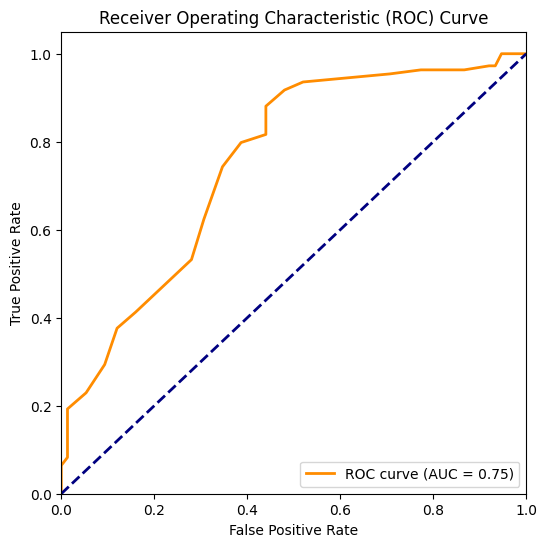

# ❤️ Heart Disease Prediction — Logistic Regression, Random Forest & ROC Curve

## 📌 Project Overview
This project predicts **heart disease (binary classification: 0 = No Disease, 1 = Disease)** using machine learning models.  
We implemented and compared:

- **Logistic Regression**
- **Random Forest Classifier**

Models are evaluated using **Confusion Matrices** and **ROC Curves**.

---

## 📊 Dataset
- **Source:** UCI Heart Disease Dataset (Cleveland subset)  
- **Features:** 13 clinical features (age, sex, chest pain type, resting blood pressure, cholesterol, fasting blood sugar, resting ECG, max heart rate, exercise angina, oldpeak, slope, ca, thal)  
- **Target:** `target` (1 = presence of heart disease, 0 = absence)

---

## ⚙️ Workflow
1. **Data Preprocessing**
   - Handle missing values
   - Standardize numerical features
   - One-hot encode categorical features  
2. **Train-test split:** 80% training, 20% testing  
3. **Models:**
   - Logistic Regression
   - Random Forest  
4. **Evaluation:**
   - Confusion Matrix  
   - Accuracy, Precision, Recall, F1-Score  
   - ROC Curve & AUC  

 5.📌 Model Performance

### 🔹 Logistic Regression
- **Accuracy:** XX%  

Confusion Matrix:  
.png)

---

### 🔹 Random Forest
- **Accuracy:** XX%  

Confusion Matrix:  
.png)

---

## 🎥 Demo Video
[Watch Demo](demo/demo.mp4)  

---

## 📑 Presentation
Project Presentation (5 slides):  
[Download Slides](DiseasePredictionPresentation.pptx)

---

## 📈 ROC Curve
ROC Curve comparison of Logistic Regression and Random Forest:  

---

